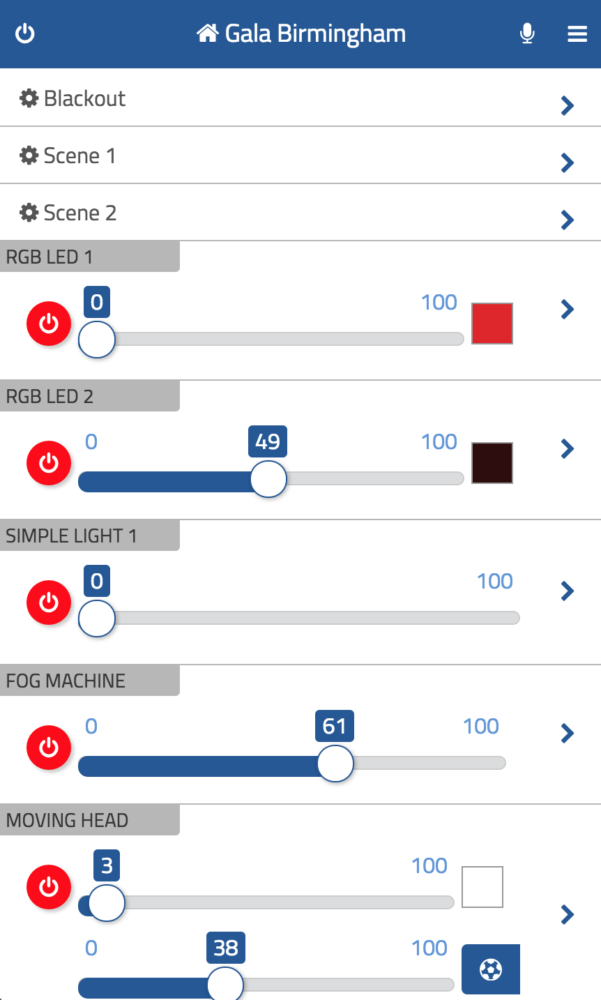

# thing-it-device-art-net

[thing-it-node] Device Plugin for Art-Net/DMX 512 universes and lighting (and other equipment) connected to those.

This allows you to 

* control Art-Net universes over the Internet,
* define complex stage designs, storyboards and timer controlled execution 

by means of [thing-it-node](https://github.com/marcgille/thing-it-node) and [thing-it.com](http://www.thing-it.com).

Using this plugin on [thing-it-node](https://github.com/marcgille/thing-it-node) is an attractive 
alternative to commercial Apps as you only need

* your DMX devices (lights, moving heads, fog machines) - you have and need anyways
* your Art-Net Ethernet/DMX512 Bridge - which you also need for the commercial Apps
* a Wifi Router - which you also need for the commercial Apps
* your Phone or Pad - which you also need for the commercial Apps
* a computer - which could be anything from a used laptop to a Raspberry Pi

In other words: you get a quite powerful Art-Net controller setup more or less for free.

## Installation

After you have 

* [set up](http://www.thing-it.com/thing-it/index.html?document=gettingStarted#/documentationPanel) your [thing-it] Node Box and 
* configured or copied a [thing-it] Mesh with Art-Net Universes, 

connect your Art-Net Universes to your [thing-it] Node Box via Wifi and probably an Art-Net/DMX512 Bridge to connect to 
your DMX devices.

## User Interface

The appearance of the UI of the Art-Net Plugin on the [thing-it] Mobile Client depends on the configured units. 
The <a href="./examples/configuration.js">sample configuration</a> specifies

* 2 RGB Lights
* 1 Simple Light
* 1 Fog Machine
* 1 Moving Head
* a Blackout Service
* 2 Stage Designs (Scene 1 and Scene 2)
* one Storyboard

and would lead to a UI like

